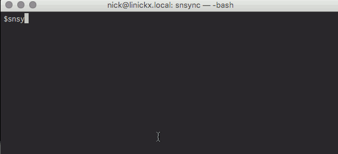

.. snsync, like rsync for Simplenote documentation master file, created by
   sphinx-quickstart on Mon Dec 12 16:01:24 2016.
   You can adapt this file completely to your liking, but it should at least
   contain the root `toctree` directive.

Welcome to snsync documentation!
=============================================================

.. toctree::
   :maxdepth: 2

snsync is a kinda rsync implementation for Simplenote where your notes can be downloaded (& and uploaded) from plain text files.

The primary use case is for periodic synchronisation by cron, with all the *useful* output going to a log file and the console output being *pretty* for when humans sync manually.

The configuration file
----------------------

By default, you need `~/.snsync` but the command line options do allow to select another file, the minimal info needed is a username and password::

   [snsync]
   cfg_sn_username = me@here.com
   cfg_sn_password = secret

*IMPORTANT! Protect your .snsync file with the correct permissions and disk encryption*

A few additional options are possible:

* `cfg_nt_path = /Users/linickx/mynotes`  to change the default note path (`~/Simplenote`)
* `cfg_log_path = /Users/Library/Logs/snsync.log` to change the default log path (which is typically within `cfg_nt_path`). Use the keyword `DISABLED` to enable console logging.
* `cfg_log_level = debug` the default logging level is `info`, the brave can change this to `error`, ninja's can enable `debug`

The command line options
------------------------

The following usage/options are available::

   Usage: snsync [OPTIONS]

   OPTIONS:
    -h, --help         Help!
    -d, --dry-run      Dry Run Mode (no changes made/saved)
    -s, --silent       Silent Mode (no std output)
    -c, --config=      Config file to read (default: ~/.snsync)
    
For example: just `snsync` on it's own should work, but something like this can be used for cron: `snsync -s --config=something.txt`

File Deletions
--------------

snsync doesn't delete any files, you can check the source code yourself ;)

When a file is marked for deletion on Simplenote, the local note (*text file*) equivalent is moved to a `.trash` directory. When a file is deleted locally the Simplenote equivalent is marked with Trash tag.

File Conflicts
--------------

If your cron job is very sporadic it possible that a change could be made on the Simplenote server and locally, when this happens the local file is renamed, for example `hello world.txt` would become  `DUP_date_hello world.txt` (*where date is the date/time the file was moved*). Duplicates are then uploaded back into Simplenote for safe keeping.

Local file names are based on the first line of the Simplenote "note". Filenames are generated on a first come, first served basis, for example if you create a Simplenote online with the first line "hello world" then `hello world.txt` will be created, if you create a 2nd note, with completely different contents but the first line is "hello world" then the 2nd file will be called `date_hello world.txt` (*where date is the date/time the file was created*)

File Modifications
------------------

snsync works by maintaining a local sqlite database, typically `.snsycn.sqlite` inside your `cfg_nt_path`. The database maintains a copy of the Simplenote list and a meta table that links Simplenotes to text files.

The script works by comparing the latest Simplenote list to the local cache, and then compares the last modified dates of local files; moves/adds/changes/deletions are then replicated by-directionally. The `--dry-run` option can be used to observe what is going to happen without making any changes.

For those wondering what the log file strings like `agtzaW1wbZRiusssu5sIDAasdfuhas` are; that's the "key" used in the Simplenote cloud to store your note, the local meta database keeps track of those and associates a file name... the cloud don't need no file names dude! ;-)

Large Note Databases
--------------------

The Simplenote API is rate limited, if your note database is large (like mine -> 1,200 notes) then the first full sync will take a long time (mine -> approx 15mins) you will also find a high number of `HTTP ERRORS` reported, just wait and re-run the script, missed notes will be downloaded.

AoB
---

No warranty is offered, use this at your own risk; I use this for my personal production notes but I always keep backups. The recommended approach is to manually download all your notes for a backup, then use the `--dry-run` option to observe changes until you are happy.

Credz, props and big-ups to https://github.com/insanum/sncli and https://github.com/mrtazz/Simplenote.py as without these opensource projects, snsync would not have got off the ground :)

.. default stuff commented out
    Indices and tables
    ==================
    
    * :ref:`genindex`
    * :ref:`modindex`
    * :ref:`search`
